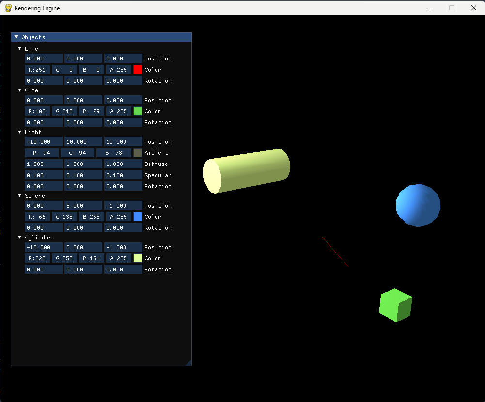
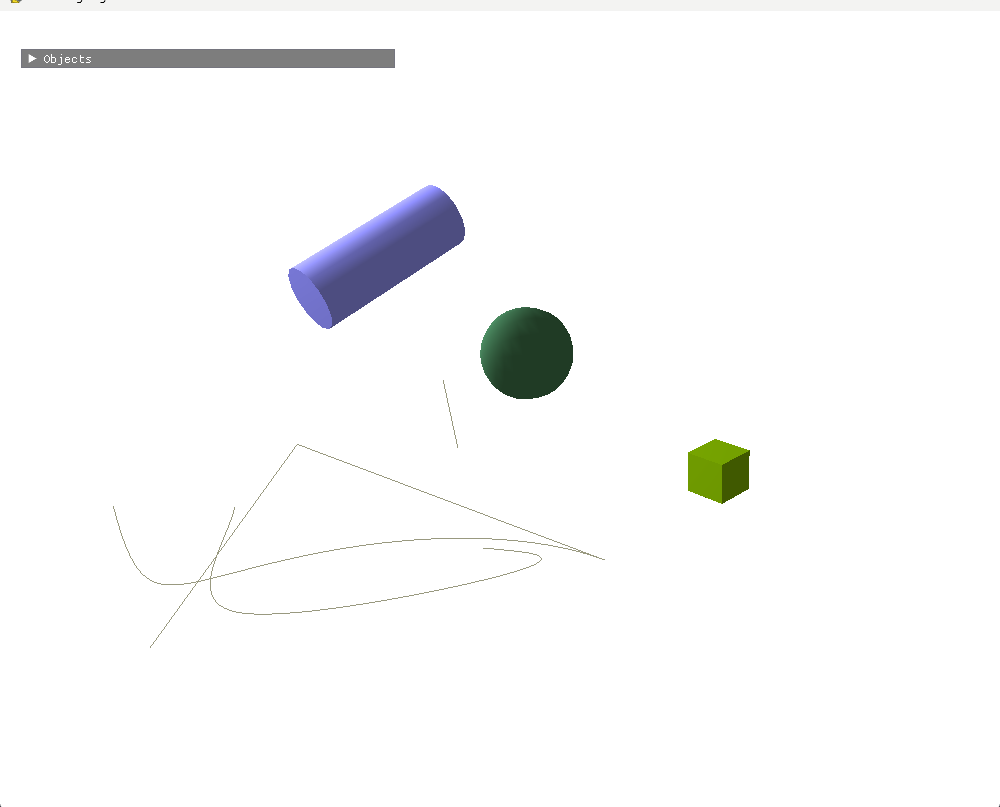

**Mini Rendering Engine**

### Purpose
The purpose of this rendering engine is to showcase various rendering algorithms and techniques, primarily aimed at educational purposes. It provides a hands-on experience for beginners to understand the fundamentals of computer graphics and OpenGL rendering.





### Features
1. **OpenGL and Pygame Integration:** The engine utilizes Python's Pygame library for window management and OpenGL for rendering. This combination offers simplicity for beginners to get started with graphics programming.
  
2. **Geometry Classes:** The engine includes classes for basic geometric shapes such as lines, cubes, and spheres. These classes serve as building blocks for demonstrating various rendering techniques.
  
3. **Lighting and Shading:** The engine supports basic lighting and shading effects, including ambient, diffuse, and specular lighting. This allows users to experiment with different lighting setups and understand their impact on object appearance.

4. **Camera Controls:** A free camera implementation enables users to navigate the scene, providing a dynamic perspective of rendered objects. This feature enhances interactivity and exploration within the rendering environment.

5. **IMGUI Integration:** The engine utilizes the ImGui library for user interface (UI) development. This library provides a lightweight and easy-to-use framework for creating GUIs.

### Usage
To use the rendering engine, follow these steps:

1. **Installation:** Ensure you have Python installed on your system. Install the required dependencies using pip:
   ```
   pip install pygame PyOpenGL numpy imgui["pygame"]
   ```
   
2. **Running the Engine:** Execute the main script (`main.py` or similarly named) to launch the rendering engine window. This window will display the rendered scene.

3. **Interacting with the Scene:** Use keyboard and mouse controls to navigate the scene and interact with objects. Refer to the provided documentation or code comments for control instructions.


### Acknowledgments
This project was inspired by the desire to provide a beginner-friendly platform for learning computer graphics concepts. Special thanks to the developers of Pygame and OpenGL for their invaluable contributions to the Python graphics ecosystem.

### Contact
For any inquiries or feedback, please contact Sujal at hello@sujal.xyz.
